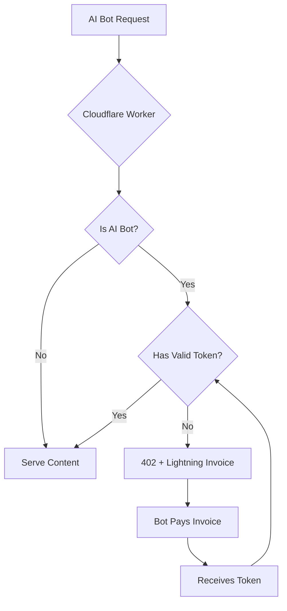

# AIPay

Block AI crawlers and offer paid access via Lightning Network micropayments.

## The Problem

AI crawlers are scraping the web to train their models. You have two choices:
1. Block them completely (lose potential traffic)
2. Let them scrape for free (lose value)

**AIPay offers a third option: Make them pay.**

## How It Works



## Features

- Detects 25+ AI crawlers (GPTBot, ClaudeBot, Bytespider, etc.)
- Returns 402 Payment Required with Lightning invoice
- Accepts L402 tokens for paid access
- Referer-based protection (browsers OK, API scrapers blocked)
- Works with any static site (Cloudflare Pages, Vercel, etc.)
- Budget tracking and token caching

## Quick Start

### 1. Create LNbits Wallet

Go to [lnbits.com](https://lnbits.com) and create a wallet.
Copy your **Wallet ID** and **Invoice Key**.

> You can use the demo server at [demo.lnbits.com](https://demo.lnbits.com/) for testing. For production, use [Voltage](https://voltage.cloud) or self-host LNbits.

### 2. Configure

Edit `worker.js` and update the config:

```javascript
const CONFIG = {
  originUrl: 'https://your-site.pages.dev',
  lnbits: {
    url: 'https://your-lnbits-instance.com',
    walletId: 'your-wallet-id',
    invoiceKey: 'your-invoice-key',
  },
  pricing: {
    perRequest: 10,
    dayPass: 1000,
    monthPass: 10000,
  },
};
```

### 3. Deploy

```bash
npm install -g wrangler
wrangler login
wrangler deploy
```

### 4. Add Custom Domain

In Cloudflare Dashboard:
1. Workers & Pages → your worker
2. Settings → Triggers → Custom Domains
3. Add your domain

## Protection Layers

| Layer | Component | Purpose |
|-------|-----------|---------|
| 1 | `robots.txt` | Voluntary compliance signal for respectful bots |
| 2 | `llms.txt` | Explains paywall and payment instructions to AI systems |
| 3 | User-Agent | Blocks known AI bot signatures (GPTBot, ClaudeBot, etc.) |
| 4 | Referer Check | Blocks direct API access (no referer = blocked) |
| 5 | L402 Token | Grants access after Lightning payment verification |

## Files

| File | Description |
|------|-------------|
| `worker.js` | Cloudflare Worker with paywall logic |
| `wrangler.toml` | Cloudflare deployment config |
| `index.html` | AI Portal page (optional API docs) |
| `robots.txt.example` | Template for blocking AI crawlers |
| `llms.txt.example` | Template explaining your paywall |

## API Endpoints

### POST /api/v1/invoice

Generate a Lightning invoice.

```bash
curl -X POST https://yourdomain.com/api/v1/invoice \
  -H "Content-Type: application/json" \
  -d '{"plan": "perRequest"}'
```

Response:
```json
{
  "success": true,
  "plan": "perRequest",
  "amount": 10,
  "invoice": {
    "bolt11": "lnbc...",
    "paymentHash": "abc123..."
  }
}
```

### GET /api/v1/verify

Check if payment is complete.

```bash
curl "https://yourdomain.com/api/v1/verify?hash=<payment_hash>"
```

### Using the Token

After payment, use the payment hash as your access token:

```bash
curl https://yourdomain.com/protected-content.json \
  -H "Authorization: L402 <payment_hash>"
```

## Pricing

| Plan | Sats | USD (approx) |
|------|------|--------------|
| perRequest | 10 | ~$0.007 |
| dayPass | 1,000 | ~$0.66 |
| monthPass | 10,000 | ~$6.62 |

> USD estimates based on BTC ≈ $66,250 (Feb 2026). Actual amounts depend on current exchange rate.

## Testing

```bash
# Normal user (should work)
curl https://yourdomain.com

# AI bot without token (should get 402)
curl -A "GPTBot/1.0" https://yourdomain.com

# Direct API access (should get 402)
curl https://yourdomain.com/data.json

# With valid token (should work)
curl -H "Authorization: L402 <token>" https://yourdomain.com/data.json
```

## AI Compatibility

We tested how different AIs handle the paywall (Feb 2026):

| AI | Reads robots.txt | Can Use Token | Notes |
|----|------------------|---------------|-------|
| Claude Code | Correctly | Yes | Extended tool access |
| Claude Web | Correctly | No | Policy prevents credential use |
| ChatGPT | "Can't access" | No | No custom header support |
| Gemini | Hallucinates content | No | Uses Google index only |

## Why Lightning?

Traditional payment methods require 2FA and human interaction. Bots can't use them.

Lightning Network enables:
- Instant micropayments (milliseconds)
- Fully automated (no 2FA required)
- Tiny amounts (fractions of cents)
- Global (no payment processor restrictions)

## Examples

### OpenClaw L402 Skill

In `examples/openclaw-skill/` you'll find a ready-to-use skill for [OpenClaw](https://openclaw.ai) that automatically pays for L402-protected content:

```bash
# Fetch protected content - auto-pays if 402
./scripts/fetch-l402.sh "https://example.com/protected.json"
```

Features:
- Automatic 402 detection and payment
- Daily budget limits
- Token caching (24h)
- Spending tracking

## Contributing

PRs welcome! See [CONTRIBUTING.md](CONTRIBUTING.md) for guidelines.

Ideas for improvement:
- Dashboard for payment analytics
- Multi-site token management
- Webhook notifications on payment
- Rate limiting per token

## License

MIT - See [LICENSE](LICENSE) for details.

## Credits

Built with:
- [Cloudflare Workers](https://workers.cloudflare.com)
- [LNbits](https://lnbits.com)
- [L402 Protocol](https://docs.lightning.engineering/the-lightning-network/l402)
